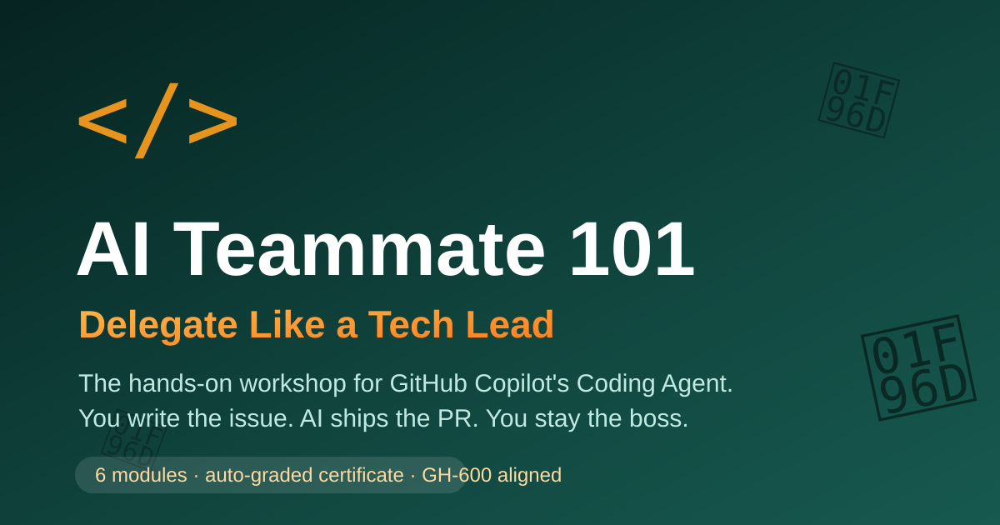

#  AI Teammate 101: Delegate Like a Tech Lead

  

  
  
  
  

> A self-paced, hands-on workshop that teaches you to work with **GitHub Copilot's Coding Agent** — the autonomous AI developer that takes a GitHub issue and returns a pull request.

**You already know how to code. This workshop teaches you how to *delegate*.**

## The loop you'll master

  

---

##  What makes this workshop different

Most AI tutorials show you a chat window. This one puts you in the **tech lead's chair**:

- :trophy: **Auto-graded.** A built-in examiner bot watches your repo and checks off milestones as you delegate, review, merge, and secure. Hit 6/6 and it awards you a shareable **Certified AI Tech Lead** certificate — right inside your own repository.
- :shield: **Real engineering gates.** TaskMango ships with CI, a PR plan-gate, CODEOWNERS routing, and least-privilege workflows — because reviewing AI code *is* the skill.
- :map: **Aligned to GH-600.** Every module maps to a domain of Microsoft's *Agentic AI Developer* certification. [See the map](GH600-MAP.md).
- :sparkle: **A sample app with personality.** TaskMango has planted bugs, a real (harmless) XSS vulnerability, and one easter egg. Complete every task and… you'll see.

## Why this workshop exists

Autocomplete was step one. Chat was step two. But the biggest productivity shift in AI-assisted development is learning to **hand off whole tasks** — writing issues so clear an AI can implement them, reviewing AI-generated code with a critical eye, and letting an agent fix its own security bugs.

That's a tech-lead skill. This workshop gives it to you in ~2.5 hours, using nothing but your own GitHub account and your own Copilot license.

## What you'll build

You'll fork this template, then spend the workshop acting as the tech lead of **TaskMango** — a delightfully mediocre task-tracker app with real bugs, thin tests, and a genuine security vulnerability. Your job isn't to fix it. Your job is to *get Copilot to fix it* — and to review its work like a professional.

## Module map

| # | Module | Time | You'll learn to… |
|---|--------|------|------------------|
| 00 | [Environment setup](setup/00-environment.md) | 15 min | Get your repo, license, and tooling ready |
| 01 | [Meet Your AI Teammate](modules/01-meet-your-ai-teammate/README.md) | 15 min | Understand what Coding Agent is (and isn't) |
| 02 | [Delegate Your First Task](modules/02-delegate-a-task/README.md) | 30 min | Run the full loop: issue  agent  PR  merge |
| 03 | [Be the Tech Lead](modules/03-become-the-tech-lead/README.md) | 30 min | Delegate in parallel & review AI code with a rubric |
| 04 | [Security on Autopilot](modules/04-security-on-autopilot/README.md) | 25 min | Use CodeQL + Copilot Autofix on a real vulnerability |
| 05 | [Build a Specialist Agent](modules/05-customize-your-agent/README.md) | 25 min | Create a custom agent tuned to your workflow |
| ★ | [Capstone](capstone/README.md) | 45 min | Ship two delegated tasks end-to-end, solo |
| 06 | [New Game+: Govern Your Agents](modules/06-new-game-plus/README.md) | 40 min | Plan gates, CODEOWNERS, least privilege, anti-patterns |
| 07 | [Multi-Agent Orchestration](modules/07-multi-agent-orchestration/README.md) | 45 min | Fan-out/fan-in, subagent handoffs, conflict arbitration |

## How to take this workshop

1. Click **Use this template  Create a new repository** (top of this page). Make it **public** — code scanning is free on public repos, and you'll need it in Module 04.
2. Work through the modules in order. Each ends with a ** checkpoint** so you know you're on track — and the ** progress bot** tracks your milestones automatically in your copy's Issues.
3. Everything happens in *your copy* of this repo. Break things freely.
4. Finish all 6 milestones  certificate unlocked  claim your spot on the [ Leaderboard](LEADERBOARD.md).

## Prerequisites

- A GitHub account
- A Copilot plan that includes the coding agent (Copilot Pro, Pro+, Business, or Enterprise — **free for verified students** via [GitHub Education](https://education.github.com)). See [setup](setup/00-environment.md) for a fallback if you're on the Free plan.
- That's it. No local install required — everything happens on GitHub.com.

## License

- Code (including the TaskMango app): [MIT](LICENSE)
- Workshop content (modules, docs): [CC BY 4.0](https://creativecommons.org/licenses/by/4.0/) — teach with it, just attribute.

## Contributing

Found friction? Ran it with a class? Open an issue or PR — and yes, assigning the issue to Copilot is an acceptable (encouraged) way to do it. 
